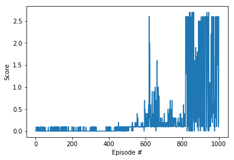
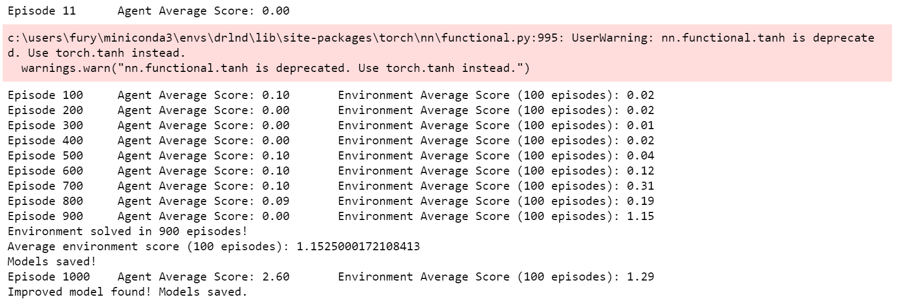

# Learning Algorithm

### Algorithm Used

The provided algorithm, deep neural network model, and check pointed weights were created from
an adaptation of DDPG used in the OpenAI Gym's Pendulum environment. See below for original details and algorithm overview.

[DDPG-Original-Pendulum](https://github.com/udacity/deep-reinforcement-learning/tree/master/ddpg-pendulum)

[DDPG Algorithm Overview](https://spinningup.openai.com/en/latest/algorithms/ddpg.html)

---

### Deep Neural Network Models

#### Actor Architecture

|Layer|Value|
|:-----:|:---:|
|Input w/ Normalization|environment state (vector length 33)|
|Linear Layer|33 x 200|
|Relu|Activation|
|Linear|200 x 100|
|Relu|Activation|
|Linear|100 x 4|
|Output w/ tanh activation|action space (vector length 4)|

Output:

A *tanh* activation was used to keep values within environment action space of -1 to 1.
Output of this network is the best believed action for any given state, even for continuous action spaces like reacher. This is a deterministic policy.

#### Critic Architecture

|Input w/ Normalization|environment state (vector length 33)|
|:-----:|:---:|
|Linear Layer|33 x 200|
|Relu|Activation|
|Concatenate|200 + action space(vector length 2), 200|
|Linear|202 x 100|
|Relu|Activation|
|Linear|100 x 1|
|Ouput|1|

Output:

*No* activation was used on the output of this layer.

*Note the concatenation was performed based on the original paper linked above to add the action
taken to the state space as input to the 2nd layer for the critic network.
Output of this network is used to compute the loss for backpropagation. The key take away is that the critic network takes into account the state space *as well as the action taken in that state space* to produce an expected return (Q value) that can be used as a target to train against.

#### Model Parameters

```
BUFFER_SIZE = int(1e5)  # replay buffer size
BATCH_SIZE = 512        # minibatch size
GAMMA = 0.99            # discount factor
TAU = 1e-3              # for soft update of target parameters
LR_ACTOR = 1e-3         # learning rate of the actor
LR_CRITIC = 1e-3        # learning rate of the critic
WEIGHT_DECAY = 0        # L2 weight decay
UPDATE_EVERY = 2        # update frequency from timesteps
NOISE_DECAY = 1e-3      # rate of noise decay (lessens noise in actions every timestep)
n_episodes = 2000
max_t = 1000
```

#### Training Results

As shown the following plot demonstrates that the environment was solved in 900 episodes based on a max score taken over all agents (2) over 100 consecutive episode average. (Score of > +0.5).

Training progress per episode:





The plot demonstrates that training scores peaked around 850 episodes and oscillated thereafter. After physically viewing the best trained model inference results the oscillations seem normal for this environment and model's training parameters.

Because this environment terminates when the ball hits the ground even if episode time steps are 'N' long, or if the ball is hit out of bounds, this abruptly cuts off any possible future reward.

For example, training DDPG in the beginning of this environment was extremely difficult because there wasn't enough exploration being done by the model even *with* noisy actions to get any kind of useful experiences. More times then not the ball just hit the ground on environment start, the episode terminated, and training never really got any traction because 99 out of 100 times there was no useful experiences being collected in the replay buffer. In addition, both agents were mirroring each others actions because there was not enough diversity in the experience tuples being collected. Because of this, I found better training times and results by just simply taking completely random actions in the environment to collect some useful experience tuples for a few hundred episodes, then beginning training using those experiences.

This yielded some traction for the model to have good and bad experiences. Noise was also incorporated into the first few hundred time steps thereafter per episode that eventually decayed to 0. This gave enough exploration to be beneficial at exploring the environment but didn't cause the training to completely crash and not recover, just oscillate as the plot shows.

I also think it is worth noting that there is a certain amount of chance involved with training a "good" model using the code and environment in this repo. Because a lot of the experiences generated are purely the result of chance, I had a hard time duplicating results from run to run. Certain training sessions never really went anywhere, while others would train and perform well. Out of multiple training runs the best models were saved and used for inference to yield the final solution to the environment.

When viewing the trained model play during inference, its apparent the model formulated a very effective strategy to maximize its score. The ball drops into the environment and is quickly recovered from wherever it drops and thrown into a *consistent* volley between the two players at the furthest ends of the court using the innermost portions of the paddles. In my mind, this minimizes the risk of the ball hitting the ground because the ball will not overshoot either paddle, while if it does undershoot the agent can move in to sweep the ball back up to keep it in play. The paddles also tend to move almost like a cat (swatting motion) when they hit the ball, again keeping the ball in the air more reliably. It was very interesting to watch.... as a result, just about every episode I watched was played to the maximum number of time steps allowed. The only time I saw a low score was when the ball was missed being dropped in on start of the environment.

#### Ideas For Future Work

- I thought this was an interesting project due to the episodic nature of the environment and its collaborate effort needed by the agents. However, I think a competitive version of this environment would be more interesting along with two separate models *competing* against one another.

- Trying to solve this environment in as few episodes as possible.

- Apply this model and techniques to the Soccer environment included in this repo.